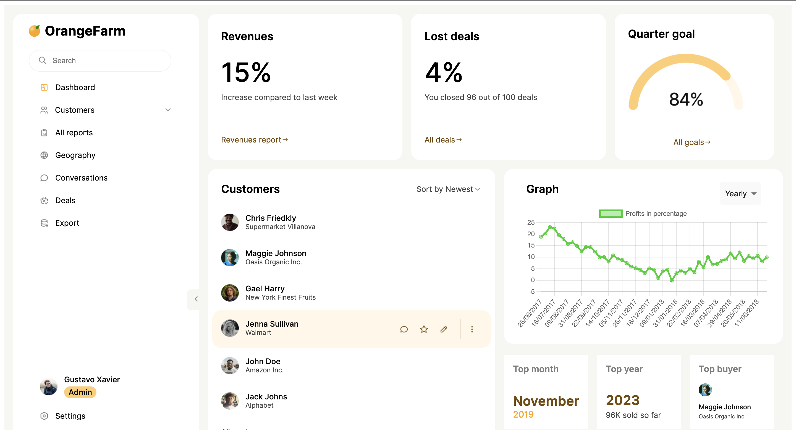

Frontend Deployment live on : https://orange-farm-mu.vercel.app/
Backend on: https://chirag4601.pythonanywhere.com/orangefarm/

SS of UI: 

For downsampling, I used Locally Adaptive Signal Processing (LASP) Algorithm which combines techniques like Piecewise Aggregate Approximation (PAA), Dynamic Time Warping (DTW), and other adaptive methods to create a locally adaptive approach for downsampling to get a clear and accurate graph plotting.
